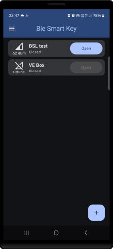
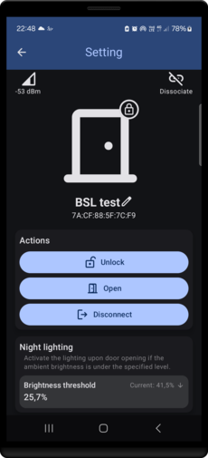
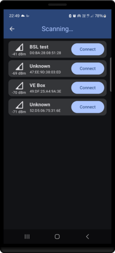

# Bluetooth LE Smart Lock - Application Android

Cette application Android, nommée **Ble Smart Key**, permet de déverrouiller de la serrure intelligente via Bluetooth Low Energy (BLE). Elle offre également la possibilité de configurer la serrure, de scanner, d'appairer, de renommer la serrure, et bien plus encore.

## Fonctionnalités

- **Déverrouillage BLE** : Utilisez le Bluetooth Low Energy pour déverrouiller votre serrure intelligente.
- **Configuration de la serrure** : Personnalisez les paramètres de votre serrure directement depuis l'application.
- **Scanner BLE** : Détectez les serrures intelligentes à proximité et appairez-les facilement.
- **Renommage de la serrure** : Donnez un nom personnalisé à chaque serrure pour une gestion simplifiée.
- **Interface utilisateur intuitive** : Naviguez facilement grâce à une interface moderne et réactive.

## Captures d'écran

## Installation

1. **Télécharger l'APK** : Téléchargez le fichier APK depuis la section des [releases](https://github.com/antoine163/ble-smart-lock-android-app/releases/download/v1.0.0/ble_smart_key_v1.0.0.apk).
2. **Installer l'application** : Transférez le fichier APK sur votre appareil Android et installez-le.
3. **Activer le Bluetooth** : Assurez-vous que le Bluetooth est activé sur votre appareil.
4. **Lancer l'application** : Ouvrez l'application et commencez à utiliser votre serrure intelligente.

## À propos

**Ble Smart Key** est ma première application Android. Bien qu'elle ne soit pas parfaite et manque encore de robustesse, les fonctionnalités principales sont présentes et fonctionnelles à un niveau minimum. Cependant, j'ai décidé d'arrêter son développement pour me consacrer à de nouveaux projets.
